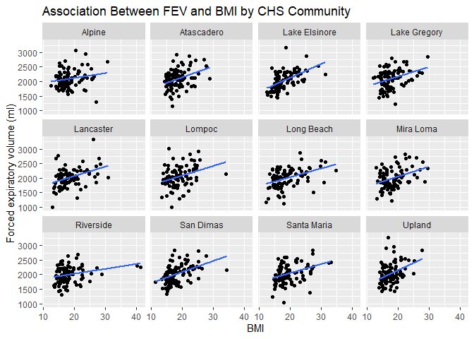
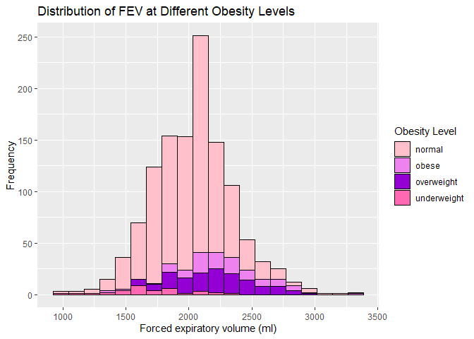
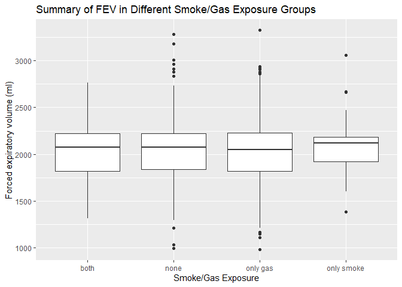
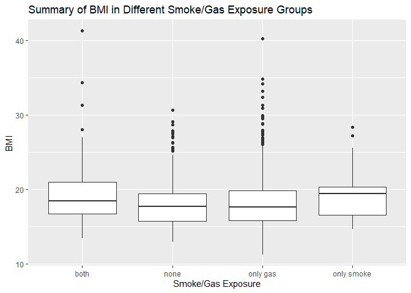

Assignment 2
================
Christina Lin
10/1/2021

``` r
library(data.table)
library(tidyverse)
```

    ## -- Attaching packages --------------------------------------- tidyverse 1.3.1 --

    ## v ggplot2 3.3.5     v purrr   0.3.4
    ## v tibble  3.1.4     v dplyr   1.0.7
    ## v tidyr   1.1.3     v stringr 1.4.0
    ## v readr   2.0.1     v forcats 0.5.1

    ## -- Conflicts ------------------------------------------ tidyverse_conflicts() --
    ## x dplyr::between()   masks data.table::between()
    ## x dplyr::filter()    masks stats::filter()
    ## x dplyr::first()     masks data.table::first()
    ## x dplyr::lag()       masks stats::lag()
    ## x dplyr::last()      masks data.table::last()
    ## x purrr::transpose() masks data.table::transpose()

``` r
if (!file.exists("individual.csv"))
  download.file(
    url = "https://raw.githubusercontent.com/USCbiostats/data-science-data/master/01_chs/chs_individual.csv",
    destfile = "individual.csv",
    method   = "libcurl",
    timeout  = 60
    )
individual <- fread("individual.csv")


if (!file.exists("regional.csv"))
  download.file(
    url = "https://raw.githubusercontent.com/USCbiostats/data-science-data/master/01_chs/chs_regional.csv",
    destfile = "regional.csv",
    method   = "libcurl",
    timeout  = 60
    )
regional <- fread("regional.csv")
```

# Data Wrangling

## Question 1: Merging the data sets

``` r
merged <- merge(
  x = individual,
  y = regional,
  all.x = TRUE, all.y = FALSE,
  by.x = "townname", by.y = "townname"
)
```

Checking dimensions to see if merge was successful

``` r
dim(individual)
```

    ## [1] 1200   23

``` r
dim(regional)
```

    ## [1] 12 27

``` r
dim(merged)
```

    ## [1] 1200   49

There are 1200 rows in the individual data set and 12 rows in the
regional data set. After merging, the new data set has 1200 rows,
indicating a successful merge.

Imputing missing values of important variables with averages within
“male” and “hispanic”

``` r
bmi_avg <- mean(merged[male==1 & hispanic==1, bmi], na.rm = TRUE)
fev_avg <- mean(merged[male==1 & hispanic==1, fev], na.rm = TRUE)
asthma_avg <- mean(merged[male==1 & hispanic==1, asthma], na.rm = TRUE)
gasstove_avg <- mean(merged[male==1 & hispanic==1, gasstove], na.rm = TRUE)
smoke_avg <- mean(merged[male==1 & hispanic==1, smoke], na.rm = TRUE)


merged[is.na(bmi), bmi := bmi_avg]
merged[is.na(fev), fev := fev_avg]
merged[is.na(asthma), asthma := asthma_avg]
```

    ## Warning in `[.data.table`(merged, is.na(asthma), `:=`(asthma, asthma_avg)):
    ## 0.160156 (type 'double') at RHS position 1 truncated (precision lost) when
    ## assigning to type 'integer' (column 10 named 'asthma')

``` r
merged[is.na(gasstove), gasstove := gasstove_avg]
```

    ## Warning in `[.data.table`(merged, is.na(gasstove), `:=`(gasstove,
    ## gasstove_avg)): 0.815686 (type 'double') at RHS position 1 truncated (precision
    ## lost) when assigning to type 'integer' (column 20 named 'gasstove')

``` r
merged[is.na(smoke), smoke := smoke_avg]
```

    ## Warning in `[.data.table`(merged, is.na(smoke), `:=`(smoke, smoke_avg)):
    ## 0.150198 (type 'double') at RHS position 1 truncated (precision lost) when
    ## assigning to type 'integer' (column 18 named 'smoke')

``` r
head(merged)
```

    ##    townname sid male race hispanic    agepft height weight      bmi asthma
    ## 1:   Alpine 835    0    W        0 10.099932    143     69 15.33749      0
    ## 2:   Alpine 838    0    O        1  9.486653    133     62 15.93183      0
    ## 3:   Alpine 839    0    M        1 10.053388    142     86 19.38649      0
    ## 4:   Alpine 840    0    W        0  9.965777    146     78 16.63283      0
    ## 5:   Alpine 841    1    W        1 10.548939    150     78 15.75758      0
    ## 6:   Alpine 842    1    M        1  9.489391    139     65 15.29189      0
    ##    active_asthma father_asthma mother_asthma wheeze hayfever allergy
    ## 1:             0             0             0      0        0       1
    ## 2:             0             0             0      0        0       0
    ## 3:             0             0             1      1        1       1
    ## 4:             0             0             0      0        0       0
    ## 5:             0             0             0      0        0       0
    ## 6:             0             0             0      1        0       0
    ##    educ_parent smoke pets gasstove      fev      fvc     mmef pm25_mass
    ## 1:           3     0    1        0 2529.276 2826.316 3406.579      8.74
    ## 2:           4     0    1        0 1737.793 1963.545 2133.110      8.74
    ## 3:           3     1    1        0 2121.711 2326.974 2835.197      8.74
    ## 4:          NA     0    0        0 2466.791 2638.221 3466.464      8.74
    ## 5:           5     0    1        0 2251.505 2594.649 2445.151      8.74
    ## 6:           1     1    1        0 2188.716 2423.934 2524.599      8.74
    ##    pm25_so4 pm25_no3 pm25_nh4 pm25_oc pm25_ec pm25_om pm10_oc pm10_ec pm10_tc
    ## 1:     1.73     1.59     0.88    2.54    0.48    3.04    3.25    0.49    3.75
    ## 2:     1.73     1.59     0.88    2.54    0.48    3.04    3.25    0.49    3.75
    ## 3:     1.73     1.59     0.88    2.54    0.48    3.04    3.25    0.49    3.75
    ## 4:     1.73     1.59     0.88    2.54    0.48    3.04    3.25    0.49    3.75
    ## 5:     1.73     1.59     0.88    2.54    0.48    3.04    3.25    0.49    3.75
    ## 6:     1.73     1.59     0.88    2.54    0.48    3.04    3.25    0.49    3.75
    ##    formic acetic  hcl hno3 o3_max o3106 o3_24   no2  pm10 no_24hr pm2_5_fr
    ## 1:   1.03   2.49 0.41 1.98  65.82 55.05 41.23 12.18 24.73    2.48    10.28
    ## 2:   1.03   2.49 0.41 1.98  65.82 55.05 41.23 12.18 24.73    2.48    10.28
    ## 3:   1.03   2.49 0.41 1.98  65.82 55.05 41.23 12.18 24.73    2.48    10.28
    ## 4:   1.03   2.49 0.41 1.98  65.82 55.05 41.23 12.18 24.73    2.48    10.28
    ## 5:   1.03   2.49 0.41 1.98  65.82 55.05 41.23 12.18 24.73    2.48    10.28
    ## 6:   1.03   2.49 0.41 1.98  65.82 55.05 41.23 12.18 24.73    2.48    10.28
    ##    iacid oacid total_acids       lon      lat
    ## 1:  2.39  3.52         5.5 -116.7664 32.83505
    ## 2:  2.39  3.52         5.5 -116.7664 32.83505
    ## 3:  2.39  3.52         5.5 -116.7664 32.83505
    ## 4:  2.39  3.52         5.5 -116.7664 32.83505
    ## 5:  2.39  3.52         5.5 -116.7664 32.83505
    ## 6:  2.39  3.52         5.5 -116.7664 32.83505

## Question 2: Creating BMI categorical variable and summary table

``` r
merged[bmi < 14, obesity_level := "underweight"]
merged[bmi >= 14 & bmi < 21, obesity_level := "normal"]
merged[bmi >= 21 & bmi < 24, obesity_level := "overweight"]
merged[bmi > 24, obesity_level := "obese"]

tab <- merged[, .(
  N_Entries = .N,
  min_BMI = min(bmi),
  max_BMI = max(bmi)
), by = obesity_level]

knitr::kable(tab)
```

| obesity\_level | N\_Entries | min\_BMI | max\_BMI |
|:---------------|-----------:|---------:|---------:|
| normal         |        924 | 14.00380 | 20.97902 |
| overweight     |        138 | 21.00399 | 23.99650 |
| obese          |        103 | 24.00647 | 41.26613 |
| underweight    |         35 | 11.29640 | 13.98601 |

## Question 3: Creating Smoke and Gas Exposure categorical variable

``` r
merged[smoke == 0 & gasstove == 0, smoke_gas_exposure := "none"]
merged[smoke == 0 & gasstove == 1, smoke_gas_exposure := "only gas"]
merged[smoke == 1 & gasstove == 0, smoke_gas_exposure := "only smoke"]
merged[smoke == 1 & gasstove == 1, smoke_gas_exposure := "both"]
```

## Question 4: Summary of FEV and Asthma indicator by town, sex, obesity level, and exposure

``` r
tab_town <- merged[, .(
  avg_fev = mean(fev),
  sd_fev = sd(fev),
  asthma_proportion = mean(asthma),
  asthma_sd = sd(asthma)), by = townname]
knitr::kable(tab_town)
```

| townname      | avg\_fev |  sd\_fev | asthma\_proportion | asthma\_sd |
|:--------------|---------:|---------:|-------------------:|-----------:|
| Alpine        | 2090.576 | 290.6566 |               0.11 |  0.3144660 |
| Atascadero    | 2081.418 | 323.5128 |               0.25 |  0.4351941 |
| Lake Elsinore | 2047.030 | 303.7138 |               0.12 |  0.3265986 |
| Lake Gregory  | 2094.811 | 318.6348 |               0.15 |  0.3588703 |
| Lancaster     | 2016.676 | 318.3450 |               0.16 |  0.3684529 |
| Lompoc        | 2045.610 | 351.1411 |               0.11 |  0.3144660 |
| Long Beach    | 1993.442 | 320.6366 |               0.13 |  0.3379977 |
| Mira Loma     | 1994.214 | 326.3779 |               0.15 |  0.3588703 |
| Riverside     | 1998.277 | 278.9353 |               0.11 |  0.3144660 |
| San Dimas     | 2029.655 | 318.9705 |               0.17 |  0.3775252 |
| Santa Maria   | 2033.301 | 312.6835 |               0.13 |  0.3379977 |
| Upland        | 2034.723 | 343.4018 |               0.12 |  0.3265986 |

``` r
tab_sex <- merged[, .(
  avg_fev = mean(fev),
  sd_fev = sd(fev),
  asthma_proportion = mean(asthma),
  asthma_sd = sd(asthma)), by = male]
knitr::kable(tab_sex)
```

| male | avg\_fev |  sd\_fev | asthma\_proportion | asthma\_sd |
|-----:|---------:|---------:|-------------------:|-----------:|
|    0 | 1973.900 | 315.3421 |          0.1180328 |  0.3229117 |
|    1 | 2104.906 | 307.5156 |          0.1677966 |  0.3740027 |

``` r
tab_obesity <- merged[, .(
  avg_fev = mean(fev),
  sd_fev = sd(fev),
  asthma_proportion = mean(asthma),
  asthma_sd = sd(asthma)), by = obesity_level]
knitr::kable(tab_obesity)
```

| obesity\_level | avg\_fev |  sd\_fev | asthma\_proportion | asthma\_sd |
|:---------------|---------:|---------:|-------------------:|-----------:|
| normal         | 2002.106 | 294.9506 |          0.1363636 |  0.3433601 |
| overweight     | 2195.419 | 309.9559 |          0.1521739 |  0.3604979 |
| obese          | 2267.848 | 324.2386 |          0.2038835 |  0.4048535 |
| underweight    | 1699.185 | 304.5785 |          0.0857143 |  0.2840286 |

``` r
tab_exposure <- merged[, .(
  avg_fev = mean(fev),
  sd_fev = sd(fev),
  asthma_proportion = mean(asthma),
  asthma_sd = sd(asthma)), by = smoke_gas_exposure]
knitr::kable(tab_exposure)
```

| smoke\_gas\_exposure | avg\_fev |  sd\_fev | asthma\_proportion | asthma\_sd |
|:---------------------|---------:|---------:|-------------------:|-----------:|
| none                 | 2047.460 | 332.8773 |          0.1365462 |  0.3440592 |
| only smoke           | 2092.556 | 297.2326 |          0.1538462 |  0.3655178 |
| only gas             | 2034.331 | 318.1718 |          0.1471748 |  0.3545131 |
| both                 | 2029.273 | 299.6817 |          0.1258278 |  0.3327589 |

# Looking at the Data

## 1. Facet plot showing scatterplots with regression lines of BMI vs FEV by “townname”.

``` r
ggplot(merged, mapping = aes(x = bmi, y = fev)) +
  geom_point()+
  geom_smooth(method = lm, se = FALSE)+
  facet_wrap(~townname)
```

    ## `geom_smooth()` using formula 'y ~ x'

<!-- -->

Observations: In most of the towns, there appears to be a positive
correlation between FEV and BMI. Towns that show little association are
Riverside and Alpine.

## 2. Stacked histograms of FEV by BMI category and FEV by smoke/gas exposure. Use different color schemes than the ggplot default.

``` r
color_pal <- c("pink","violet", "darkviolet", "hot pink")

ggplot(merged, mapping = aes(x=fev, fill = obesity_level)) +
  geom_histogram(col = "black", bins = 20) +
  scale_fill_manual(values = color_pal)
```

<!-- -->

``` r
ggplot(merged, mapping = aes(x=fev, fill = smoke_gas_exposure)) +
  geom_histogram(col = "black", bins = 20) +
  scale_fill_brewer(palette = "Greens")
```

<!-- -->

Observations: From the FEV-BMI histogram, it appears that there are more
observations of higher FEV in the overweight and obese categories. There
are also more observations of lower FEV in underweight and normal
categories. This supports the trend seen in the scatterplots above with
positive correlation between FEV and BMI. From the FEV-Smoke/Gas
Exposure histogram, it appears that there are more observations of lower
FEV with gas exposure. The trend between FEV and smoke exposure is
difficult to tell from the histogram.

## 3. Bar chart of BMI by smoke/gas exposure.

``` r
ggplot(merged, mapping = aes(x = smoke_gas_exposure, y = bmi)) +
  geom_bar(stat= "summary")
```

    ## No summary function supplied, defaulting to `mean_se()`

<!-- -->

Observations: This graph indicates little difference in bmi between the
different smoke and gas exposure groups.

## 4. Statistical summary graphs of FEV by BMI and FEV by smoke/gas exposure category.

``` r
ggplot(merged, mapping = aes(x = smoke_gas_exposure, y = fev)) +
  geom_boxplot()
```

<!-- -->

``` r
ggplot(merged, mapping = aes(x = smoke_gas_exposure, y = bmi)) +
  geom_boxplot()
```

<!-- -->

Observations: The bar plots indicate that the median and quartile values
are rather similar between the different smoke and gas exposure groups
in terms of fev and bmi. The median bmi is slightly higher in the only
smoke exposure group.

## 5. A leaflet map showing the concentrations of PM2.5 mass in each of the CHS communities.

``` r
library(leaflet)

pal <- colorNumeric(palette="viridis", domain=merged$pm25_mass)

leaflet(merged) %>%
  addProviderTiles('CartoDB.Positron') %>%
  addCircles(
    lat = ~lat, lng=~lon,
    color = ~pal(pm25_mass),
    opacity = 1, fillOpacity = 1, radius = 500
    ) %>%
  addLegend('bottomleft', pal=pal, values=merged$pm25_mass,
          title='PM2.5 Mass', opacity=1)
```

Observations: The highest PM2.5 mass is found in communities around
Riverside, Long Beach, and San Bernardino.

## 6. Choose a visualization to examine whether PM2.5 mass is associated with FEV.

``` r
ggplot(merged, mapping = aes(x = pm25_mass, y = fev)) +
  geom_point()+
  geom_smooth(method = lm, se = FALSE)+
  geom_jitter()
```

    ## `geom_smooth()` using formula 'y ~ x'

<!-- -->

Observations: There may be a trend towards a negative association
between fev and pm25\_mass, but it is not obvious and is likely not a
significant association.

## Conclusions

There is a positive association between BMI and FEV. However, there are
no obvious associations between FEV and smoke/gas exposure as well as
FEV and PM2.5 exposure.
