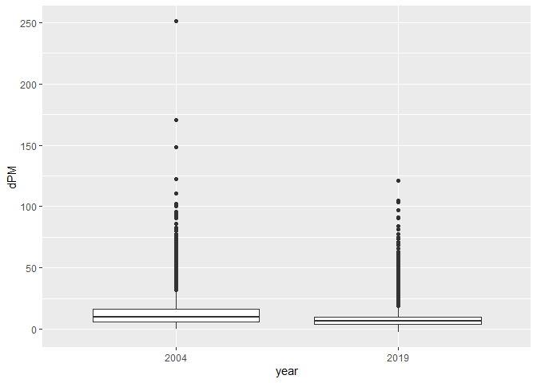
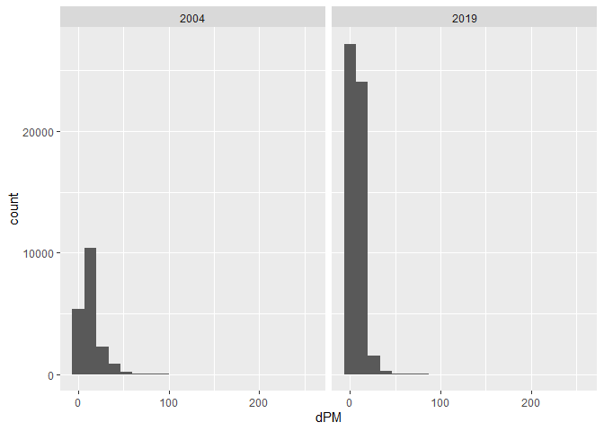
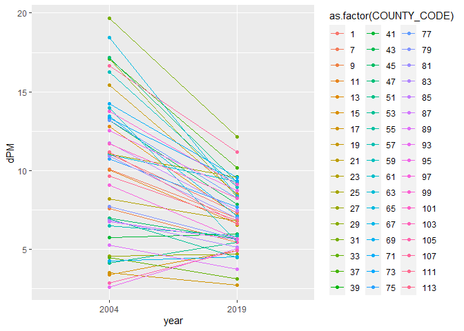
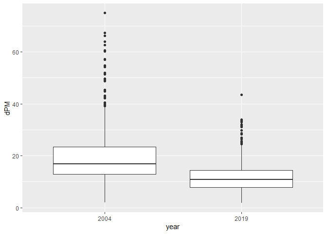
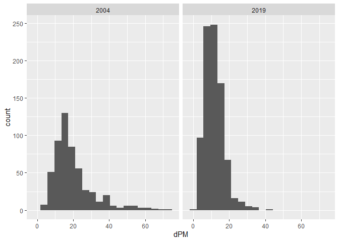

Assignment 1
================
Christina Lin
9/17/2021

# Step 1. Retrieving data and checking for missing values

Reading 2004 and 2019 Data

``` r
library(data.table)
library(tidyverse)
```

    ## -- Attaching packages --------------------------------------- tidyverse 1.3.1 --

    ## v ggplot2 3.3.5     v purrr   0.3.4
    ## v tibble  3.1.4     v dplyr   1.0.7
    ## v tidyr   1.1.3     v stringr 1.4.0
    ## v readr   2.0.1     v forcats 0.5.1

    ## -- Conflicts ------------------------------------------ tidyverse_conflicts() --
    ## x dplyr::between()   masks data.table::between()
    ## x dplyr::filter()    masks stats::filter()
    ## x dplyr::first()     masks data.table::first()
    ## x dplyr::lag()       masks stats::lag()
    ## x dplyr::last()      masks data.table::last()
    ## x purrr::transpose() masks data.table::transpose()

``` r
if (!file.exists("2004_data.csv"))
  download.file(
    url = "https://www3.epa.gov/cgi-bin/broker?_service=data&_server=134.67.99.91&_port=4075&_sessionid=etmkhIr/R52&_PROGRAM=dataprog.ad_viz_plotval_getdata.sas",
    destfile = "2004_data.csv",
    method   = "libcurl",
    timeout  = 60
    )
pm2004 <- data.table::fread("2004_data.csv")


if (!file.exists("2019_data.csv"))
  download.file(
    url = "https://www3.epa.gov/cgi-bin/broker?_service=data&_server=134.67.99.91&_port=4075&_sessionid=uJZrnIr/R52&_PROGRAM=dataprog.ad_viz_plotval_getdata.sas",
    destfile = "2019_data.csv",
    method   = "libcurl",
    timeout  = 60
    )
pm2019 <- data.table::fread("2019_data.csv")
```

Checking dimensions, headers, footers, variables names and variable
types

``` r
# For 2004 Dataset
dim(pm2004)
```

    ## [1] 19233    20

``` r
head(pm2004)
```

    ##          Date Source  Site ID POC Daily Mean PM2.5 Concentration    UNITS
    ## 1: 01/01/2004    AQS 60010007   1                           11.0 ug/m3 LC
    ## 2: 01/02/2004    AQS 60010007   1                           12.2 ug/m3 LC
    ## 3: 01/03/2004    AQS 60010007   1                           16.5 ug/m3 LC
    ## 4: 01/04/2004    AQS 60010007   1                           19.5 ug/m3 LC
    ## 5: 01/05/2004    AQS 60010007   1                           11.5 ug/m3 LC
    ## 6: 01/06/2004    AQS 60010007   1                           32.5 ug/m3 LC
    ##    DAILY_AQI_VALUE Site Name DAILY_OBS_COUNT PERCENT_COMPLETE
    ## 1:              46 Livermore               1              100
    ## 2:              51 Livermore               1              100
    ## 3:              60 Livermore               1              100
    ## 4:              67 Livermore               1              100
    ## 5:              48 Livermore               1              100
    ## 6:              94 Livermore               1              100
    ##    AQS_PARAMETER_CODE                     AQS_PARAMETER_DESC CBSA_CODE
    ## 1:              88502 Acceptable PM2.5 AQI & Speciation Mass     41860
    ## 2:              88502 Acceptable PM2.5 AQI & Speciation Mass     41860
    ## 3:              88502 Acceptable PM2.5 AQI & Speciation Mass     41860
    ## 4:              88502 Acceptable PM2.5 AQI & Speciation Mass     41860
    ## 5:              88502 Acceptable PM2.5 AQI & Speciation Mass     41860
    ## 6:              88502 Acceptable PM2.5 AQI & Speciation Mass     41860
    ##                            CBSA_NAME STATE_CODE      STATE COUNTY_CODE  COUNTY
    ## 1: San Francisco-Oakland-Hayward, CA          6 California           1 Alameda
    ## 2: San Francisco-Oakland-Hayward, CA          6 California           1 Alameda
    ## 3: San Francisco-Oakland-Hayward, CA          6 California           1 Alameda
    ## 4: San Francisco-Oakland-Hayward, CA          6 California           1 Alameda
    ## 5: San Francisco-Oakland-Hayward, CA          6 California           1 Alameda
    ## 6: San Francisco-Oakland-Hayward, CA          6 California           1 Alameda
    ##    SITE_LATITUDE SITE_LONGITUDE
    ## 1:      37.68753      -121.7842
    ## 2:      37.68753      -121.7842
    ## 3:      37.68753      -121.7842
    ## 4:      37.68753      -121.7842
    ## 5:      37.68753      -121.7842
    ## 6:      37.68753      -121.7842

``` r
tail(pm2004)
```

    ##          Date Source  Site ID POC Daily Mean PM2.5 Concentration    UNITS
    ## 1: 12/14/2004    AQS 61131003   1                             11 ug/m3 LC
    ## 2: 12/17/2004    AQS 61131003   1                             16 ug/m3 LC
    ## 3: 12/20/2004    AQS 61131003   1                             17 ug/m3 LC
    ## 4: 12/23/2004    AQS 61131003   1                              9 ug/m3 LC
    ## 5: 12/26/2004    AQS 61131003   1                             24 ug/m3 LC
    ## 6: 12/29/2004    AQS 61131003   1                              9 ug/m3 LC
    ##    DAILY_AQI_VALUE            Site Name DAILY_OBS_COUNT PERCENT_COMPLETE
    ## 1:              46 Woodland-Gibson Road               1              100
    ## 2:              59 Woodland-Gibson Road               1              100
    ## 3:              61 Woodland-Gibson Road               1              100
    ## 4:              38 Woodland-Gibson Road               1              100
    ## 5:              76 Woodland-Gibson Road               1              100
    ## 6:              38 Woodland-Gibson Road               1              100
    ##    AQS_PARAMETER_CODE       AQS_PARAMETER_DESC CBSA_CODE
    ## 1:              88101 PM2.5 - Local Conditions     40900
    ## 2:              88101 PM2.5 - Local Conditions     40900
    ## 3:              88101 PM2.5 - Local Conditions     40900
    ## 4:              88101 PM2.5 - Local Conditions     40900
    ## 5:              88101 PM2.5 - Local Conditions     40900
    ## 6:              88101 PM2.5 - Local Conditions     40900
    ##                                  CBSA_NAME STATE_CODE      STATE COUNTY_CODE
    ## 1: Sacramento--Roseville--Arden-Arcade, CA          6 California         113
    ## 2: Sacramento--Roseville--Arden-Arcade, CA          6 California         113
    ## 3: Sacramento--Roseville--Arden-Arcade, CA          6 California         113
    ## 4: Sacramento--Roseville--Arden-Arcade, CA          6 California         113
    ## 5: Sacramento--Roseville--Arden-Arcade, CA          6 California         113
    ## 6: Sacramento--Roseville--Arden-Arcade, CA          6 California         113
    ##    COUNTY SITE_LATITUDE SITE_LONGITUDE
    ## 1:   Yolo      38.66121      -121.7327
    ## 2:   Yolo      38.66121      -121.7327
    ## 3:   Yolo      38.66121      -121.7327
    ## 4:   Yolo      38.66121      -121.7327
    ## 5:   Yolo      38.66121      -121.7327
    ## 6:   Yolo      38.66121      -121.7327

``` r
str(pm2004)
```

    ## Classes 'data.table' and 'data.frame':   19233 obs. of  20 variables:
    ##  $ Date                          : chr  "01/01/2004" "01/02/2004" "01/03/2004" "01/04/2004" ...
    ##  $ Source                        : chr  "AQS" "AQS" "AQS" "AQS" ...
    ##  $ Site ID                       : int  60010007 60010007 60010007 60010007 60010007 60010007 60010007 60010007 60010007 60010007 ...
    ##  $ POC                           : int  1 1 1 1 1 1 1 1 1 1 ...
    ##  $ Daily Mean PM2.5 Concentration: num  11 12.2 16.5 19.5 11.5 32.5 14 29.9 21 16.9 ...
    ##  $ UNITS                         : chr  "ug/m3 LC" "ug/m3 LC" "ug/m3 LC" "ug/m3 LC" ...
    ##  $ DAILY_AQI_VALUE               : int  46 51 60 67 48 94 55 88 70 61 ...
    ##  $ Site Name                     : chr  "Livermore" "Livermore" "Livermore" "Livermore" ...
    ##  $ DAILY_OBS_COUNT               : int  1 1 1 1 1 1 1 1 1 1 ...
    ##  $ PERCENT_COMPLETE              : num  100 100 100 100 100 100 100 100 100 100 ...
    ##  $ AQS_PARAMETER_CODE            : int  88502 88502 88502 88502 88502 88502 88101 88502 88502 88502 ...
    ##  $ AQS_PARAMETER_DESC            : chr  "Acceptable PM2.5 AQI & Speciation Mass" "Acceptable PM2.5 AQI & Speciation Mass" "Acceptable PM2.5 AQI & Speciation Mass" "Acceptable PM2.5 AQI & Speciation Mass" ...
    ##  $ CBSA_CODE                     : int  41860 41860 41860 41860 41860 41860 41860 41860 41860 41860 ...
    ##  $ CBSA_NAME                     : chr  "San Francisco-Oakland-Hayward, CA" "San Francisco-Oakland-Hayward, CA" "San Francisco-Oakland-Hayward, CA" "San Francisco-Oakland-Hayward, CA" ...
    ##  $ STATE_CODE                    : int  6 6 6 6 6 6 6 6 6 6 ...
    ##  $ STATE                         : chr  "California" "California" "California" "California" ...
    ##  $ COUNTY_CODE                   : int  1 1 1 1 1 1 1 1 1 1 ...
    ##  $ COUNTY                        : chr  "Alameda" "Alameda" "Alameda" "Alameda" ...
    ##  $ SITE_LATITUDE                 : num  37.7 37.7 37.7 37.7 37.7 ...
    ##  $ SITE_LONGITUDE                : num  -122 -122 -122 -122 -122 ...
    ##  - attr(*, ".internal.selfref")=<externalptr>

``` r
# For 2019 Dataset
dim(pm2019)
```

    ## [1] 53086    20

``` r
head(pm2019)
```

    ##          Date Source  Site ID POC Daily Mean PM2.5 Concentration    UNITS
    ## 1: 01/01/2019    AQS 60010007   3                            5.7 ug/m3 LC
    ## 2: 01/02/2019    AQS 60010007   3                           11.9 ug/m3 LC
    ## 3: 01/03/2019    AQS 60010007   3                           20.1 ug/m3 LC
    ## 4: 01/04/2019    AQS 60010007   3                           28.8 ug/m3 LC
    ## 5: 01/05/2019    AQS 60010007   3                           11.2 ug/m3 LC
    ## 6: 01/06/2019    AQS 60010007   3                            2.7 ug/m3 LC
    ##    DAILY_AQI_VALUE Site Name DAILY_OBS_COUNT PERCENT_COMPLETE
    ## 1:              24 Livermore               1              100
    ## 2:              50 Livermore               1              100
    ## 3:              68 Livermore               1              100
    ## 4:              86 Livermore               1              100
    ## 5:              47 Livermore               1              100
    ## 6:              11 Livermore               1              100
    ##    AQS_PARAMETER_CODE       AQS_PARAMETER_DESC CBSA_CODE
    ## 1:              88101 PM2.5 - Local Conditions     41860
    ## 2:              88101 PM2.5 - Local Conditions     41860
    ## 3:              88101 PM2.5 - Local Conditions     41860
    ## 4:              88101 PM2.5 - Local Conditions     41860
    ## 5:              88101 PM2.5 - Local Conditions     41860
    ## 6:              88101 PM2.5 - Local Conditions     41860
    ##                            CBSA_NAME STATE_CODE      STATE COUNTY_CODE  COUNTY
    ## 1: San Francisco-Oakland-Hayward, CA          6 California           1 Alameda
    ## 2: San Francisco-Oakland-Hayward, CA          6 California           1 Alameda
    ## 3: San Francisco-Oakland-Hayward, CA          6 California           1 Alameda
    ## 4: San Francisco-Oakland-Hayward, CA          6 California           1 Alameda
    ## 5: San Francisco-Oakland-Hayward, CA          6 California           1 Alameda
    ## 6: San Francisco-Oakland-Hayward, CA          6 California           1 Alameda
    ##    SITE_LATITUDE SITE_LONGITUDE
    ## 1:      37.68753      -121.7842
    ## 2:      37.68753      -121.7842
    ## 3:      37.68753      -121.7842
    ## 4:      37.68753      -121.7842
    ## 5:      37.68753      -121.7842
    ## 6:      37.68753      -121.7842

``` r
tail(pm2019)
```

    ##          Date Source  Site ID POC Daily Mean PM2.5 Concentration    UNITS
    ## 1: 11/11/2019    AQS 61131003   1                           13.5 ug/m3 LC
    ## 2: 11/17/2019    AQS 61131003   1                           18.1 ug/m3 LC
    ## 3: 11/29/2019    AQS 61131003   1                           12.5 ug/m3 LC
    ## 4: 12/17/2019    AQS 61131003   1                           23.8 ug/m3 LC
    ## 5: 12/23/2019    AQS 61131003   1                            1.0 ug/m3 LC
    ## 6: 12/29/2019    AQS 61131003   1                            9.1 ug/m3 LC
    ##    DAILY_AQI_VALUE            Site Name DAILY_OBS_COUNT PERCENT_COMPLETE
    ## 1:              54 Woodland-Gibson Road               1              100
    ## 2:              64 Woodland-Gibson Road               1              100
    ## 3:              52 Woodland-Gibson Road               1              100
    ## 4:              76 Woodland-Gibson Road               1              100
    ## 5:               4 Woodland-Gibson Road               1              100
    ## 6:              38 Woodland-Gibson Road               1              100
    ##    AQS_PARAMETER_CODE       AQS_PARAMETER_DESC CBSA_CODE
    ## 1:              88101 PM2.5 - Local Conditions     40900
    ## 2:              88101 PM2.5 - Local Conditions     40900
    ## 3:              88101 PM2.5 - Local Conditions     40900
    ## 4:              88101 PM2.5 - Local Conditions     40900
    ## 5:              88101 PM2.5 - Local Conditions     40900
    ## 6:              88101 PM2.5 - Local Conditions     40900
    ##                                  CBSA_NAME STATE_CODE      STATE COUNTY_CODE
    ## 1: Sacramento--Roseville--Arden-Arcade, CA          6 California         113
    ## 2: Sacramento--Roseville--Arden-Arcade, CA          6 California         113
    ## 3: Sacramento--Roseville--Arden-Arcade, CA          6 California         113
    ## 4: Sacramento--Roseville--Arden-Arcade, CA          6 California         113
    ## 5: Sacramento--Roseville--Arden-Arcade, CA          6 California         113
    ## 6: Sacramento--Roseville--Arden-Arcade, CA          6 California         113
    ##    COUNTY SITE_LATITUDE SITE_LONGITUDE
    ## 1:   Yolo      38.66121      -121.7327
    ## 2:   Yolo      38.66121      -121.7327
    ## 3:   Yolo      38.66121      -121.7327
    ## 4:   Yolo      38.66121      -121.7327
    ## 5:   Yolo      38.66121      -121.7327
    ## 6:   Yolo      38.66121      -121.7327

``` r
str(pm2019)
```

    ## Classes 'data.table' and 'data.frame':   53086 obs. of  20 variables:
    ##  $ Date                          : chr  "01/01/2019" "01/02/2019" "01/03/2019" "01/04/2019" ...
    ##  $ Source                        : chr  "AQS" "AQS" "AQS" "AQS" ...
    ##  $ Site ID                       : int  60010007 60010007 60010007 60010007 60010007 60010007 60010007 60010007 60010007 60010007 ...
    ##  $ POC                           : int  3 3 3 3 3 3 3 3 3 3 ...
    ##  $ Daily Mean PM2.5 Concentration: num  5.7 11.9 20.1 28.8 11.2 2.7 2.8 7 3.1 7.1 ...
    ##  $ UNITS                         : chr  "ug/m3 LC" "ug/m3 LC" "ug/m3 LC" "ug/m3 LC" ...
    ##  $ DAILY_AQI_VALUE               : int  24 50 68 86 47 11 12 29 13 30 ...
    ##  $ Site Name                     : chr  "Livermore" "Livermore" "Livermore" "Livermore" ...
    ##  $ DAILY_OBS_COUNT               : int  1 1 1 1 1 1 1 1 1 1 ...
    ##  $ PERCENT_COMPLETE              : num  100 100 100 100 100 100 100 100 100 100 ...
    ##  $ AQS_PARAMETER_CODE            : int  88101 88101 88101 88101 88101 88101 88101 88101 88101 88101 ...
    ##  $ AQS_PARAMETER_DESC            : chr  "PM2.5 - Local Conditions" "PM2.5 - Local Conditions" "PM2.5 - Local Conditions" "PM2.5 - Local Conditions" ...
    ##  $ CBSA_CODE                     : int  41860 41860 41860 41860 41860 41860 41860 41860 41860 41860 ...
    ##  $ CBSA_NAME                     : chr  "San Francisco-Oakland-Hayward, CA" "San Francisco-Oakland-Hayward, CA" "San Francisco-Oakland-Hayward, CA" "San Francisco-Oakland-Hayward, CA" ...
    ##  $ STATE_CODE                    : int  6 6 6 6 6 6 6 6 6 6 ...
    ##  $ STATE                         : chr  "California" "California" "California" "California" ...
    ##  $ COUNTY_CODE                   : int  1 1 1 1 1 1 1 1 1 1 ...
    ##  $ COUNTY                        : chr  "Alameda" "Alameda" "Alameda" "Alameda" ...
    ##  $ SITE_LATITUDE                 : num  37.7 37.7 37.7 37.7 37.7 ...
    ##  $ SITE_LONGITUDE                : num  -122 -122 -122 -122 -122 ...
    ##  - attr(*, ".internal.selfref")=<externalptr>

Checking for issues in key variables

``` r
summary(pm2004$`Daily Mean PM2.5 Concentration`)
```

    ##    Min. 1st Qu.  Median    Mean 3rd Qu.    Max. 
    ##   -0.10    6.00   10.10   13.13   16.30  251.00

``` r
summary(pm2004$SITE_LATITUDE)
```

    ##    Min. 1st Qu.  Median    Mean 3rd Qu.    Max. 
    ##   32.63   34.07   36.48   36.23   38.10   41.71

``` r
summary(pm2004$SITE_LONGITUDE)
```

    ##    Min. 1st Qu.  Median    Mean 3rd Qu.    Max. 
    ##  -124.2  -121.6  -119.3  -119.7  -117.9  -115.5

``` r
mean(is.na(pm2004$`Daily Mean PM2.5 Concentration`))
```

    ## [1] 0

``` r
mean(is.na(pm2004$SITE_LATITUDE))
```

    ## [1] 0

``` r
mean(is.na(pm2004$SITE_LONGITUDE))
```

    ## [1] 0

``` r
summary(pm2019$`Daily Mean PM2.5 Concentration`)
```

    ##    Min. 1st Qu.  Median    Mean 3rd Qu.    Max. 
    ##  -2.200   4.000   6.500   7.733   9.900 120.900

``` r
summary(pm2019$SITE_LATITUDE)
```

    ##    Min. 1st Qu.  Median    Mean 3rd Qu.    Max. 
    ##   32.58   34.14   36.63   36.35   37.97   41.76

``` r
summary(pm2019$SITE_LONGITUDE)
```

    ##    Min. 1st Qu.  Median    Mean 3rd Qu.    Max. 
    ##  -124.2  -121.6  -119.8  -119.8  -118.1  -115.5

``` r
mean(is.na(pm2019$`Daily Mean PM2.5 Concentration`))
```

    ## [1] 0

``` r
mean(is.na(pm2019$SITE_LATITUDE))
```

    ## [1] 0

``` r
mean(is.na(pm2019$SITE_LONGITUDE))
```

    ## [1] 0

In 2004, there were 19233 observations total. In 2019, there were 53086
observations total. There are no missing values (i.e. “NA”s) for daily
mean 2.5 concentration, latitude, and longitude for both the 2004 and
2019 datasets. Upon examining the minimum and maximum values for these
variables, there does not appear to be any “9999” in place of missing
values either. Thus, the datasets looks ready for analysis.

# Step 2: Combining the two data sets into one data frame

``` r
library(dplyr)
pm <- rbind(pm2004, pm2019)

#Adding year as a new column and simplifying names of key variables 
pm <- mutate(pm, year = factor(rep(c(2004, 2019), c(nrow(pm2004), nrow(pm2019))))) %>%
  rename(dPM ="Daily Mean PM2.5 Concentration") %>%
  rename(lat = SITE_LATITUDE) %>%
  rename(lon = SITE_LONGITUDE) %>%
  rename(site = "Site ID") %>%
  rename(site_name = "Site Name")
str(pm)
```

    ## Classes 'data.table' and 'data.frame':   72319 obs. of  21 variables:
    ##  $ Date              : chr  "01/01/2004" "01/02/2004" "01/03/2004" "01/04/2004" ...
    ##  $ Source            : chr  "AQS" "AQS" "AQS" "AQS" ...
    ##  $ site              : int  60010007 60010007 60010007 60010007 60010007 60010007 60010007 60010007 60010007 60010007 ...
    ##  $ POC               : int  1 1 1 1 1 1 1 1 1 1 ...
    ##  $ dPM               : num  11 12.2 16.5 19.5 11.5 32.5 14 29.9 21 16.9 ...
    ##  $ UNITS             : chr  "ug/m3 LC" "ug/m3 LC" "ug/m3 LC" "ug/m3 LC" ...
    ##  $ DAILY_AQI_VALUE   : int  46 51 60 67 48 94 55 88 70 61 ...
    ##  $ site_name         : chr  "Livermore" "Livermore" "Livermore" "Livermore" ...
    ##  $ DAILY_OBS_COUNT   : int  1 1 1 1 1 1 1 1 1 1 ...
    ##  $ PERCENT_COMPLETE  : num  100 100 100 100 100 100 100 100 100 100 ...
    ##  $ AQS_PARAMETER_CODE: int  88502 88502 88502 88502 88502 88502 88101 88502 88502 88502 ...
    ##  $ AQS_PARAMETER_DESC: chr  "Acceptable PM2.5 AQI & Speciation Mass" "Acceptable PM2.5 AQI & Speciation Mass" "Acceptable PM2.5 AQI & Speciation Mass" "Acceptable PM2.5 AQI & Speciation Mass" ...
    ##  $ CBSA_CODE         : int  41860 41860 41860 41860 41860 41860 41860 41860 41860 41860 ...
    ##  $ CBSA_NAME         : chr  "San Francisco-Oakland-Hayward, CA" "San Francisco-Oakland-Hayward, CA" "San Francisco-Oakland-Hayward, CA" "San Francisco-Oakland-Hayward, CA" ...
    ##  $ STATE_CODE        : int  6 6 6 6 6 6 6 6 6 6 ...
    ##  $ STATE             : chr  "California" "California" "California" "California" ...
    ##  $ COUNTY_CODE       : int  1 1 1 1 1 1 1 1 1 1 ...
    ##  $ COUNTY            : chr  "Alameda" "Alameda" "Alameda" "Alameda" ...
    ##  $ lat               : num  37.7 37.7 37.7 37.7 37.7 ...
    ##  $ lon               : num  -122 -122 -122 -122 -122 ...
    ##  $ year              : Factor w/ 2 levels "2004","2019": 1 1 1 1 1 1 1 1 1 1 ...
    ##  - attr(*, ".internal.selfref")=<externalptr>

# Step 3: Create a basic map in leaflet() that shows the locations of the sites

``` r
library(leaflet)

pal <- colorFactor(palette=c('red','blue'), domain=pm$year)

leaflet(pm) %>%
  addProviderTiles('CartoDB.Positron') %>%
  addCircles(
    lat = ~lat, lng=~lon,
    color = ~pal(year),
    opacity = 1, fillOpacity = 1, radius = 500
    ) %>%
  addLegend('bottomleft', pal=pal, values=pm$year,
          title='Year', opacity=1)
```


Observations: The sites in 2004 were mainly at the north and south ends
of California while in 2019, the sites are more evenly scattered around
the state.

# Step 4: Check for any missing or implausible values of PM in the combined dataset

``` r
summary(pm)
```

    ##      Date              Source               site               POC        
    ##  Length:72319       Length:72319       Min.   :60010007   Min.   : 1.000  
    ##  Class :character   Class :character   1st Qu.:60311004   1st Qu.: 1.000  
    ##  Mode  :character   Mode  :character   Median :60650009   Median : 3.000  
    ##                                        Mean   :60571337   Mean   : 2.363  
    ##                                        3rd Qu.:60771002   3rd Qu.: 3.000  
    ##                                        Max.   :61131003   Max.   :21.000  
    ##                                                                           
    ##       dPM             UNITS           DAILY_AQI_VALUE   site_name        
    ##  Min.   : -2.200   Length:72319       Min.   :  0.00   Length:72319      
    ##  1st Qu.:  4.400   Class :character   1st Qu.: 18.00   Class :character  
    ##  Median :  7.200   Mode  :character   Median : 30.00   Mode  :character  
    ##  Mean   :  9.168                      Mean   : 34.75                     
    ##  3rd Qu.: 11.300                      3rd Qu.: 47.00                     
    ##  Max.   :251.000                      Max.   :301.00                     
    ##                                                                          
    ##  DAILY_OBS_COUNT PERCENT_COMPLETE AQS_PARAMETER_CODE AQS_PARAMETER_DESC
    ##  Min.   :1       Min.   :100      Min.   :88101      Length:72319      
    ##  1st Qu.:1       1st Qu.:100      1st Qu.:88101      Class :character  
    ##  Median :1       Median :100      Median :88101      Mode  :character  
    ##  Mean   :1       Mean   :100      Mean   :88228                        
    ##  3rd Qu.:1       3rd Qu.:100      3rd Qu.:88502                        
    ##  Max.   :1       Max.   :100      Max.   :88502                        
    ##                                                                        
    ##    CBSA_CODE      CBSA_NAME           STATE_CODE    STATE          
    ##  Min.   :12540   Length:72319       Min.   :6    Length:72319      
    ##  1st Qu.:31080   Class :character   1st Qu.:6    Class :character  
    ##  Median :40140   Mode  :character   Median :6    Mode  :character  
    ##  Mean   :35703                      Mean   :6                      
    ##  3rd Qu.:41860                      3rd Qu.:6                      
    ##  Max.   :49700                      Max.   :6                      
    ##  NA's   :5434                                                      
    ##   COUNTY_CODE        COUNTY               lat             lon        
    ##  Min.   :  1.00   Length:72319       Min.   :32.58   Min.   :-124.2  
    ##  1st Qu.: 31.00   Class :character   1st Qu.:34.11   1st Qu.:-121.6  
    ##  Median : 65.00   Mode  :character   Median :36.49   Median :-119.8  
    ##  Mean   : 56.98                      Mean   :36.32   Mean   :-119.8  
    ##  3rd Qu.: 77.00                      3rd Qu.:38.09   3rd Qu.:-118.1  
    ##  Max.   :113.00                      Max.   :41.76   Max.   :-115.5  
    ##                                                                      
    ##    year      
    ##  2004:19233  
    ##  2019:53086  
    ##              
    ##              
    ##              
    ##              
    ## 

Observations: There are PM2.5 values that are negative, which does not
seem plausible since these values represent a concentration.

``` r
#Filtering out the data points that have negative PM2.5 values
pm2 <- pm[dPM < 0]
summary(pm2)
```

    ##      Date              Source               site               POC       
    ##  Length:283         Length:283         Min.   :60010011   Min.   :1.000  
    ##  Class :character   Class :character   1st Qu.:60611004   1st Qu.:3.000  
    ##  Mode  :character   Mode  :character   Median :60611004   Median :3.000  
    ##                                        Mean   :60618567   Mean   :2.703  
    ##                                        3rd Qu.:60659001   3rd Qu.:3.000  
    ##                                        Max.   :61113001   Max.   :9.000  
    ##                                                                          
    ##       dPM             UNITS           DAILY_AQI_VALUE  site_name        
    ##  Min.   :-2.2000   Length:283         Min.   :0       Length:283        
    ##  1st Qu.:-1.5000   Class :character   1st Qu.:0       Class :character  
    ##  Median :-0.8000   Mode  :character   Median :0       Mode  :character  
    ##  Mean   :-0.9173                      Mean   :0                         
    ##  3rd Qu.:-0.3000                      3rd Qu.:0                         
    ##  Max.   :-0.1000                      Max.   :0                         
    ##                                                                         
    ##  DAILY_OBS_COUNT PERCENT_COMPLETE AQS_PARAMETER_CODE AQS_PARAMETER_DESC
    ##  Min.   :1       Min.   :100      Min.   :88101      Length:283        
    ##  1st Qu.:1       1st Qu.:100      1st Qu.:88101      Class :character  
    ##  Median :1       Median :100      Median :88502      Mode  :character  
    ##  Mean   :1       Mean   :100      Mean   :88389                        
    ##  3rd Qu.:1       3rd Qu.:100      3rd Qu.:88502                        
    ##  Max.   :1       Max.   :100      Max.   :88502                        
    ##                                                                        
    ##    CBSA_CODE      CBSA_NAME           STATE_CODE    STATE          
    ##  Min.   :12540   Length:283         Min.   :6    Length:283        
    ##  1st Qu.:40140   Class :character   1st Qu.:6    Class :character  
    ##  Median :40900   Mode  :character   Median :6    Mode  :character  
    ##  Mean   :39109                      Mean   :6                      
    ##  3rd Qu.:40900                      3rd Qu.:6                      
    ##  Max.   :46380                      Max.   :6                      
    ##  NA's   :2                                                         
    ##   COUNTY_CODE        COUNTY               lat             lon        
    ##  Min.   :  1.00   Length:283         Min.   :33.22   Min.   :-123.4  
    ##  1st Qu.: 61.00   Class :character   1st Qu.:35.05   1st Qu.:-120.1  
    ##  Median : 61.00   Mode  :character   Median :39.17   Median :-120.1  
    ##  Mean   : 61.65                      Mean   :37.56   Mean   :-119.9  
    ##  3rd Qu.: 65.00                      3rd Qu.:39.17   3rd Qu.:-120.1  
    ##  Max.   :111.00                      Max.   :40.73   Max.   :-116.8  
    ##                                                                      
    ##    year    
    ##  2004:  1  
    ##  2019:282  
    ##            
    ##            
    ##            
    ##            
    ## 

``` r
pal2 <- colorFactor(palette=c('red','blue'), domain=pm2$year)

leaflet(pm2) %>%
  addProviderTiles('CartoDB.Positron') %>%
  addCircles(
    lat = ~lat, lng=~lon,
    color = ~pal2(year),
    opacity = 1, fillOpacity = 1, radius = 500
    ) %>%
  addLegend('bottomleft', pal=pal2, values=pm2$year,
          title='Year', opacity=1)
```

<div id="htmlwidget-9c25d6799e8a1332f601" style="width:672px;height:480px;" class="leaflet html-widget"></div>
<script type="application/json" data-for="htmlwidget-9c25d6799e8a1332f601">{"x":{"options":{"crs":{"crsClass":"L.CRS.EPSG3857","code":null,"proj4def":null,"projectedBounds":null,"options":{}}},"calls":[{"method":"addProviderTiles","args":["CartoDB.Positron",null,null,{"errorTileUrl":"","noWrap":false,"detectRetina":false}]},{"method":"addCircles","args":[[37.2206398607598,37.814781,37.793624,39.76168,39.76168,39.77919,39.77919,37.936013,37.936013,36.9851185574381,36.9851185574381,36.9851185574381,36.9851185574381,36.198672,36.198672,36.6342250009037,35.6429431008838,35.6429431008838,35.6429431008838,35.6429431008838,35.6429431008838,34.841567,34.841567,34.841567,34.841567,34.6697390008831,34.6697390008831,34.6697390008831,39.15047,39.15047,39.15047,39.15047,39.41174,39.41174,36.4818700009023,36.6942610009043,36.6942610009043,36.6942610009043,36.6942610009043,36.6942610009043,38.93568,39.100174496,39.100174496,39.1660166666667,39.1660166666667,39.1660166666667,39.1660166666667,39.1660166666667,39.1660166666667,39.1660166666667,39.1660166666667,39.1660166666667,39.1660166666667,39.1660166666667,39.1660166666667,39.1660166666667,39.1660166666667,39.1660166666667,39.1660166666667,39.1660166666667,39.1660166666667,39.1660166666667,39.1660166666667,39.1660166666667,39.1660166666667,39.1660166666667,39.1660166666667,39.1660166666667,39.1660166666667,39.1660166666667,39.1660166666667,39.1660166666667,39.1660166666667,39.1660166666667,39.1660166666667,39.1660166666667,39.1660166666667,39.1660166666667,39.1660166666667,39.1660166666667,39.1660166666667,39.1660166666667,39.1660166666667,39.1660166666667,39.1660166666667,39.1660166666667,39.1660166666667,39.1660166666667,39.1660166666667,39.1660166666667,39.1660166666667,39.1660166666667,39.1660166666667,39.1660166666667,39.1660166666667,39.1660166666667,39.1660166666667,39.1660166666667,39.1660166666667,39.1660166666667,39.1660166666667,39.1660166666667,39.1660166666667,39.1660166666667,39.1660166666667,39.1660166666667,39.1660166666667,39.1660166666667,39.1660166666667,39.1660166666667,39.1660166666667,39.1660166666667,39.1660166666667,39.1660166666667,39.1660166666667,39.1660166666667,39.1660166666667,39.1660166666667,39.1660166666667,39.1660166666667,39.1660166666667,39.1660166666667,39.1660166666667,39.1660166666667,39.1660166666667,39.1660166666667,39.1660166666667,39.1660166666667,39.1660166666667,39.1660166666667,39.1660166666667,39.1660166666667,39.1660166666667,39.1660166666667,39.1660166666667,39.1660166666667,39.1660166666667,39.1660166666667,39.1660166666667,39.1660166666667,39.1660166666667,39.1660166666667,39.1660166666667,39.1660166666667,39.1660166666667,39.1660166666667,39.1660166666667,39.1660166666667,39.1660166666667,39.1660166666667,39.1660166666667,39.1660166666667,39.1660166666667,39.1660166666667,39.1660166666667,39.1660166666667,39.1660166666667,39.1660166666667,39.1660166666667,39.1660166666667,39.1660166666667,39.1660166666667,39.1660166666667,39.1660166666667,39.1660166666667,39.1660166666667,39.1660166666667,39.1660166666667,39.1660166666667,39.1660166666667,39.1660166666667,39.1660166666667,39.1660166666667,39.1660166666667,39.1660166666667,39.1660166666667,39.1660166666667,39.1660166666667,39.1660166666667,39.1660166666667,39.1660166666667,39.1660166666667,39.1660166666667,39.1660166666667,39.1660166666667,39.1660166666667,39.1660166666667,39.1660166666667,39.1660166666667,39.1660166666667,39.1660166666667,39.1660166666667,39.1660166666667,39.1660166666667,39.1660166666667,39.1660166666667,33.4478670008682,33.4478670008682,33.4478670008682,33.9447129,33.9995800008751,33.67649,33.67649,33.67649,33.67649,33.67649,33.67649,33.67649,33.67649,33.67649,33.67649,33.67649,33.67649,33.67649,33.67649,33.67649,33.67649,33.67649,33.67649,33.67649,33.67649,33.67649,33.67649,33.67649,33.67649,33.67649,33.67649,33.67649,33.67649,33.67649,33.67649,38.6137790009202,38.683304,38.683304,38.494475,38.494475,34.10374,34.10374,33.2170550008652,33.2170550008652,37.793392,35.0467300008874,35.0467300008874,35.0467300008874,35.0467300008874,35.0467300008874,35.0467300008874,35.0467300008874,35.0467300008874,35.0467300008874,35.49453,35.49453,37.482934,34.942872,34.942872,34.6378200008827,34.6378200008827,34.6378200008827,34.6378200008827,34.6378200008827,34.6378200008827,34.6378200008827,34.6378200008827,34.6378200008827,34.6378200008827,34.6378200008827,34.6378200008827,34.4455100008805,34.4455100008805,40.17093,40.17093,40.17093,40.17093,40.73475,40.73475,34.210169,34.404281,34.404281,34.404281,34.404281,34.404281,34.276316,34.25239],[-119.155556956851,-122.282347,-122.263376,-121.84047,-121.84047,-121.59135,-121.59135,-122.026154,-122.026154,-119.658339349936,-119.658339349936,-119.658339349936,-119.658339349936,-120.101096,-120.101096,-120.382331,-117.715066487047,-117.715066487047,-117.715066487047,-117.715066487047,-117.715066487047,-118.860588,-118.860588,-118.860588,-118.860588,-118.130511,-118.130511,-118.130511,-123.20655,-123.20655,-123.20655,-123.20655,-123.35264,-123.35264,-121.73333,-121.623271,-121.623271,-121.623271,-121.623271,-121.623271,-121.09959,-120.953831711,-120.953831711,-120.148833333333,-120.148833333333,-120.148833333333,-120.148833333333,-120.148833333333,-120.148833333333,-120.148833333333,-120.148833333333,-120.148833333333,-120.148833333333,-120.148833333333,-120.148833333333,-120.148833333333,-120.148833333333,-120.148833333333,-120.148833333333,-120.148833333333,-120.148833333333,-120.148833333333,-120.148833333333,-120.148833333333,-120.148833333333,-120.148833333333,-120.148833333333,-120.148833333333,-120.148833333333,-120.148833333333,-120.148833333333,-120.148833333333,-120.148833333333,-120.148833333333,-120.148833333333,-120.148833333333,-120.148833333333,-120.148833333333,-120.148833333333,-120.148833333333,-120.148833333333,-120.148833333333,-120.148833333333,-120.148833333333,-120.148833333333,-120.148833333333,-120.148833333333,-120.148833333333,-120.148833333333,-120.148833333333,-120.148833333333,-120.148833333333,-120.148833333333,-120.148833333333,-120.148833333333,-120.148833333333,-120.148833333333,-120.148833333333,-120.148833333333,-120.148833333333,-120.148833333333,-120.148833333333,-120.148833333333,-120.148833333333,-120.148833333333,-120.148833333333,-120.148833333333,-120.148833333333,-120.148833333333,-120.148833333333,-120.148833333333,-120.148833333333,-120.148833333333,-120.148833333333,-120.148833333333,-120.148833333333,-120.148833333333,-120.148833333333,-120.148833333333,-120.148833333333,-120.148833333333,-120.148833333333,-120.148833333333,-120.148833333333,-120.148833333333,-120.148833333333,-120.148833333333,-120.148833333333,-120.148833333333,-120.148833333333,-120.148833333333,-120.148833333333,-120.148833333333,-120.148833333333,-120.148833333333,-120.148833333333,-120.148833333333,-120.148833333333,-120.148833333333,-120.148833333333,-120.148833333333,-120.148833333333,-120.148833333333,-120.148833333333,-120.148833333333,-120.148833333333,-120.148833333333,-120.148833333333,-120.148833333333,-120.148833333333,-120.148833333333,-120.148833333333,-120.148833333333,-120.148833333333,-120.148833333333,-120.148833333333,-120.148833333333,-120.148833333333,-120.148833333333,-120.148833333333,-120.148833333333,-120.148833333333,-120.148833333333,-120.148833333333,-120.148833333333,-120.148833333333,-120.148833333333,-120.148833333333,-120.148833333333,-120.148833333333,-120.148833333333,-120.148833333333,-120.148833333333,-120.148833333333,-120.148833333333,-120.148833333333,-120.148833333333,-120.148833333333,-120.148833333333,-120.148833333333,-120.148833333333,-120.148833333333,-120.148833333333,-120.148833333333,-120.148833333333,-120.148833333333,-120.148833333333,-120.148833333333,-120.148833333333,-120.148833333333,-120.148833333333,-120.148833333333,-120.148833333333,-120.148833333333,-120.148833333333,-120.148833333333,-117.088649,-117.088649,-117.088649,-116.830074,-117.41601,-117.33098,-117.33098,-117.33098,-117.33098,-117.33098,-117.33098,-117.33098,-117.33098,-117.33098,-117.33098,-117.33098,-117.33098,-117.33098,-117.33098,-117.33098,-117.33098,-117.33098,-117.33098,-117.33098,-117.33098,-117.33098,-117.33098,-117.33098,-117.33098,-117.33098,-117.33098,-117.33098,-117.33098,-117.33098,-117.33098,-121.368014,-121.164457,-121.164457,-121.211131,-121.211131,-117.62914,-117.62914,-117.396177,-117.396177,-121.247874,-120.58777,-120.58777,-120.58777,-120.58777,-120.58777,-120.58777,-120.58777,-120.58777,-120.58777,-120.66617,-120.66617,-122.20337,-120.435611,-120.435611,-120.4575,-120.4575,-120.4575,-120.4575,-120.4575,-120.4575,-120.4575,-120.4575,-120.4575,-120.4575,-120.4575,-120.4575,-119.8284,-119.8284,-122.25556,-122.25556,-122.25556,-122.25556,-122.9412,-122.9412,-118.870509,-118.80998,-118.80998,-118.80998,-118.80998,-118.80998,-118.683685,-119.143182],500,null,null,{"interactive":true,"className":"","stroke":true,"color":["#FF0000","#0000FF","#0000FF","#0000FF","#0000FF","#0000FF","#0000FF","#0000FF","#0000FF","#0000FF","#0000FF","#0000FF","#0000FF","#0000FF","#0000FF","#0000FF","#0000FF","#0000FF","#0000FF","#0000FF","#0000FF","#0000FF","#0000FF","#0000FF","#0000FF","#0000FF","#0000FF","#0000FF","#0000FF","#0000FF","#0000FF","#0000FF","#0000FF","#0000FF","#0000FF","#0000FF","#0000FF","#0000FF","#0000FF","#0000FF","#0000FF","#0000FF","#0000FF","#0000FF","#0000FF","#0000FF","#0000FF","#0000FF","#0000FF","#0000FF","#0000FF","#0000FF","#0000FF","#0000FF","#0000FF","#0000FF","#0000FF","#0000FF","#0000FF","#0000FF","#0000FF","#0000FF","#0000FF","#0000FF","#0000FF","#0000FF","#0000FF","#0000FF","#0000FF","#0000FF","#0000FF","#0000FF","#0000FF","#0000FF","#0000FF","#0000FF","#0000FF","#0000FF","#0000FF","#0000FF","#0000FF","#0000FF","#0000FF","#0000FF","#0000FF","#0000FF","#0000FF","#0000FF","#0000FF","#0000FF","#0000FF","#0000FF","#0000FF","#0000FF","#0000FF","#0000FF","#0000FF","#0000FF","#0000FF","#0000FF","#0000FF","#0000FF","#0000FF","#0000FF","#0000FF","#0000FF","#0000FF","#0000FF","#0000FF","#0000FF","#0000FF","#0000FF","#0000FF","#0000FF","#0000FF","#0000FF","#0000FF","#0000FF","#0000FF","#0000FF","#0000FF","#0000FF","#0000FF","#0000FF","#0000FF","#0000FF","#0000FF","#0000FF","#0000FF","#0000FF","#0000FF","#0000FF","#0000FF","#0000FF","#0000FF","#0000FF","#0000FF","#0000FF","#0000FF","#0000FF","#0000FF","#0000FF","#0000FF","#0000FF","#0000FF","#0000FF","#0000FF","#0000FF","#0000FF","#0000FF","#0000FF","#0000FF","#0000FF","#0000FF","#0000FF","#0000FF","#0000FF","#0000FF","#0000FF","#0000FF","#0000FF","#0000FF","#0000FF","#0000FF","#0000FF","#0000FF","#0000FF","#0000FF","#0000FF","#0000FF","#0000FF","#0000FF","#0000FF","#0000FF","#0000FF","#0000FF","#0000FF","#0000FF","#0000FF","#0000FF","#0000FF","#0000FF","#0000FF","#0000FF","#0000FF","#0000FF","#0000FF","#0000FF","#0000FF","#0000FF","#0000FF","#0000FF","#0000FF","#0000FF","#0000FF","#0000FF","#0000FF","#0000FF","#0000FF","#0000FF","#0000FF","#0000FF","#0000FF","#0000FF","#0000FF","#0000FF","#0000FF","#0000FF","#0000FF","#0000FF","#0000FF","#0000FF","#0000FF","#0000FF","#0000FF","#0000FF","#0000FF","#0000FF","#0000FF","#0000FF","#0000FF","#0000FF","#0000FF","#0000FF","#0000FF","#0000FF","#0000FF","#0000FF","#0000FF","#0000FF","#0000FF","#0000FF","#0000FF","#0000FF","#0000FF","#0000FF","#0000FF","#0000FF","#0000FF","#0000FF","#0000FF","#0000FF","#0000FF","#0000FF","#0000FF","#0000FF","#0000FF","#0000FF","#0000FF","#0000FF","#0000FF","#0000FF","#0000FF","#0000FF","#0000FF","#0000FF","#0000FF","#0000FF","#0000FF","#0000FF","#0000FF","#0000FF","#0000FF","#0000FF","#0000FF","#0000FF","#0000FF","#0000FF","#0000FF","#0000FF","#0000FF","#0000FF","#0000FF","#0000FF","#0000FF","#0000FF","#0000FF","#0000FF","#0000FF","#0000FF","#0000FF","#0000FF","#0000FF"],"weight":5,"opacity":1,"fill":true,"fillColor":["#FF0000","#0000FF","#0000FF","#0000FF","#0000FF","#0000FF","#0000FF","#0000FF","#0000FF","#0000FF","#0000FF","#0000FF","#0000FF","#0000FF","#0000FF","#0000FF","#0000FF","#0000FF","#0000FF","#0000FF","#0000FF","#0000FF","#0000FF","#0000FF","#0000FF","#0000FF","#0000FF","#0000FF","#0000FF","#0000FF","#0000FF","#0000FF","#0000FF","#0000FF","#0000FF","#0000FF","#0000FF","#0000FF","#0000FF","#0000FF","#0000FF","#0000FF","#0000FF","#0000FF","#0000FF","#0000FF","#0000FF","#0000FF","#0000FF","#0000FF","#0000FF","#0000FF","#0000FF","#0000FF","#0000FF","#0000FF","#0000FF","#0000FF","#0000FF","#0000FF","#0000FF","#0000FF","#0000FF","#0000FF","#0000FF","#0000FF","#0000FF","#0000FF","#0000FF","#0000FF","#0000FF","#0000FF","#0000FF","#0000FF","#0000FF","#0000FF","#0000FF","#0000FF","#0000FF","#0000FF","#0000FF","#0000FF","#0000FF","#0000FF","#0000FF","#0000FF","#0000FF","#0000FF","#0000FF","#0000FF","#0000FF","#0000FF","#0000FF","#0000FF","#0000FF","#0000FF","#0000FF","#0000FF","#0000FF","#0000FF","#0000FF","#0000FF","#0000FF","#0000FF","#0000FF","#0000FF","#0000FF","#0000FF","#0000FF","#0000FF","#0000FF","#0000FF","#0000FF","#0000FF","#0000FF","#0000FF","#0000FF","#0000FF","#0000FF","#0000FF","#0000FF","#0000FF","#0000FF","#0000FF","#0000FF","#0000FF","#0000FF","#0000FF","#0000FF","#0000FF","#0000FF","#0000FF","#0000FF","#0000FF","#0000FF","#0000FF","#0000FF","#0000FF","#0000FF","#0000FF","#0000FF","#0000FF","#0000FF","#0000FF","#0000FF","#0000FF","#0000FF","#0000FF","#0000FF","#0000FF","#0000FF","#0000FF","#0000FF","#0000FF","#0000FF","#0000FF","#0000FF","#0000FF","#0000FF","#0000FF","#0000FF","#0000FF","#0000FF","#0000FF","#0000FF","#0000FF","#0000FF","#0000FF","#0000FF","#0000FF","#0000FF","#0000FF","#0000FF","#0000FF","#0000FF","#0000FF","#0000FF","#0000FF","#0000FF","#0000FF","#0000FF","#0000FF","#0000FF","#0000FF","#0000FF","#0000FF","#0000FF","#0000FF","#0000FF","#0000FF","#0000FF","#0000FF","#0000FF","#0000FF","#0000FF","#0000FF","#0000FF","#0000FF","#0000FF","#0000FF","#0000FF","#0000FF","#0000FF","#0000FF","#0000FF","#0000FF","#0000FF","#0000FF","#0000FF","#0000FF","#0000FF","#0000FF","#0000FF","#0000FF","#0000FF","#0000FF","#0000FF","#0000FF","#0000FF","#0000FF","#0000FF","#0000FF","#0000FF","#0000FF","#0000FF","#0000FF","#0000FF","#0000FF","#0000FF","#0000FF","#0000FF","#0000FF","#0000FF","#0000FF","#0000FF","#0000FF","#0000FF","#0000FF","#0000FF","#0000FF","#0000FF","#0000FF","#0000FF","#0000FF","#0000FF","#0000FF","#0000FF","#0000FF","#0000FF","#0000FF","#0000FF","#0000FF","#0000FF","#0000FF","#0000FF","#0000FF","#0000FF","#0000FF","#0000FF","#0000FF","#0000FF","#0000FF","#0000FF","#0000FF","#0000FF","#0000FF","#0000FF","#0000FF","#0000FF","#0000FF","#0000FF","#0000FF","#0000FF","#0000FF","#0000FF","#0000FF","#0000FF","#0000FF","#0000FF","#0000FF","#0000FF","#0000FF","#0000FF"],"fillOpacity":1},null,null,null,{"interactive":false,"permanent":false,"direction":"auto","opacity":1,"offset":[0,0],"textsize":"10px","textOnly":false,"className":"","sticky":true},null,null]},{"method":"addLegend","args":[{"colors":["#FF0000","#0000FF"],"labels":["2004","2019"],"na_color":null,"na_label":"NA","opacity":1,"position":"bottomleft","type":"factor","title":"Year","extra":null,"layerId":null,"className":"info legend","group":null}]}],"limits":{"lat":[33.2170550008652,40.73475],"lng":[-123.35264,-116.830074]}},"evals":[],"jsHooks":[]}</script>

Observations: There is 1 negative PM2.5 value recorded in 2004 and 282
of such values in 2019. By mapping these data points, it appears that
the negative value recorded in 2004 is located in the middle of the
state. The negative values recorded in 2019 are rather evenly spread out
throughout the state.

# Step 5: Explore the main question of interest at three different spatial levels

Comparing PM2.5 levels between 2004 and 2019 at the state level

``` r
ggplot(data = pm, mapping = aes(x = year, y = dPM)) +
  geom_boxplot()
```

<!-- -->

``` r
ggplot(data = pm, mapping = aes(x = dPM)) +
  geom_histogram(bins=20) +
  facet_grid(~year)
```

<!-- -->

``` r
summary(pm[year==2004 & dPM >= 0,dPM])
```

    ##    Min. 1st Qu.  Median    Mean 3rd Qu.    Max. 
    ##    0.00    6.00   10.10   13.13   16.30  251.00

``` r
summary(pm[year==2019 & dPM >=0 ,dPM])
```

    ##    Min. 1st Qu.  Median    Mean 3rd Qu.    Max. 
    ##    0.00    4.00    6.50    7.78   10.00  120.90

Observations: The average and media PM2.5 levels appear lower in 2019
than 2004 and the maximum PM2.5 level measured is lower in 2019. This is
the case when negative values are included but also when negative values
are excluded from the statistics summary.

Comparing PM2.5 levels between 2004 and 2019 at the county level

``` r
#Averaging daily PM2.5 values, grouped by year and county code 
pm_county_avg <- group_by(pm, year, COUNTY_CODE) %>%
  summarize(dPM = mean(dPM))
```

    ## `summarise()` has grouped output by 'year'. You can override using the `.groups` argument.

``` r
head(pm_county_avg)
```

    ## # A tibble: 6 x 3
    ## # Groups:   year [1]
    ##   year  COUNTY_CODE   dPM
    ##   <fct>       <int> <dbl>
    ## 1 2004            1 11.0 
    ## 2 2004            7 10.1 
    ## 3 2004            9  7.61
    ## 4 2004           11 10.0 
    ## 5 2004           13 12.8 
    ## 6 2004           15  3.41

``` r
tail(pm_county_avg)
```

    ## # A tibble: 6 x 3
    ## # Groups:   year [1]
    ##   year  COUNTY_CODE   dPM
    ##   <fct>       <int> <dbl>
    ## 1 2019          101  8.27
    ## 2 2019          103  5.43
    ## 3 2019          105  4.91
    ## 4 2019          107 11.2 
    ## 5 2019          111  6.65
    ## 6 2019          113  6.85

``` r
#Making line graph to show change in PM2.5 values in counties between the two years
ggplot(data = pm_county_avg, mapping = aes(x = year,y = dPM, color = as.factor(COUNTY_CODE))) +
  geom_point() +
  geom_line(aes(group= as.factor(COUNTY_CODE)))
```

<!-- -->

Observations: In most counties, the average PM2.5 values have decreased
from 2004 to 2019. There are a few counties that saw increased average
PM2.5 values, but these increases are not very big.

Comparing PM2.5 levels between 2004 and 2019 at Los Angeles site

``` r
pm_la <- filter(pm, site_name == "Los Angeles-North Main Street")

ggplot(data = pm_la, mapping = aes(x = year, y = dPM)) +
  geom_boxplot()
```

<!-- -->

``` r
ggplot(data = pm_la, mapping = aes(x = dPM)) +
  geom_histogram(bins=20) +
  facet_grid(~year)
```

<!-- -->

Observations: At the site in LA, the average PM2.5 values are lower in
2019 compared to 2004. The histogram also shows that there are more
observations at lower PM2.5 values in 2019 compared to 2004.

Conclusion: Daily PM 2.5 values in California appear to have decreased
from 2004 to 2019.
