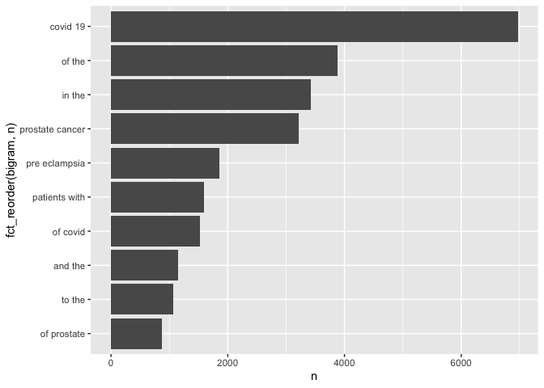

Assignment 3
================
Christina Lin
10/29/2021

# Part 1: APIs

``` r
# Downloading the website
website <- xml2::read_html("https://pubmed.ncbi.nlm.nih.gov/?term=sars-cov-2+trial+vaccine")

# Finding the number of papers
counts <- xml2::xml_find_first(website, xpath = "/html/body/main/div[9]/div[2]/div[2]/div[1]/div[1]/span")

counts <- as.character(counts)
counts <- stringr::str_extract(counts, "[[:digit:],]+")
counts <- stringr::str_remove_all(counts, ",")
counts <- as.integer(counts)
```

When searched on the PubMed website with the term “sars-cov-2 trial
vaccine”, there are 2329 results.

Using the NCBI API

``` r
query_ids <- GET(
  url   = "https://eutils.ncbi.nlm.nih.gov/entrez/eutils/esearch.fcgi",
  query = list(
    db = "pubmed",
    term = "sars-cov-2 trial vaccine",
    retmax = "5000"
)
)
# Extracting the content of the response of GET
ids <- httr::content(query_ids)

# Turn the result into a character vector
ids <- as.character(ids)

# Find all the ids 
ids <- stringr::str_extract_all(ids, "<Id>[[:digit:]]+</Id>")[[1]]
# Remove all the leading and trailing <Id> </Id>. Make use of "|"
ids <- stringr::str_remove_all(ids, "<Id>|</Id>")
```

Searching the NCBI API returns 1044 UIDs for publications associated
with “sars-cov-2 trial vaccine”.

Now getting the details for the first 250 papers.

``` r
# Getting the abstract of the papers

publications <- GET(
  url   = "https://eutils.ncbi.nlm.nih.gov/",
  path = "entrez/eutils/efetch.fcgi",
  query = list(
    db = "pubmed",
    id = I(paste(ids[1:250], collapse=",")),
    retmax = "250",
    rettype = "abstract"
    )
)

# Turning the output into character vector
publications <- httr::content(publications)
#publications_txt <- as.character(publications)
```

Forming a database:

``` r
pub_char_list <- xml2::xml_children(publications)
pub_char_list <- sapply(pub_char_list, as.character)
```

Getting the titles

``` r
titles <- str_extract(pub_char_list, "<ArticleTitle>[[:print:][:space:]]+</ArticleTitle>")
titles <- str_remove_all(titles, "</?[[:alnum:][:punct:]]+>")
```

Getting the journals

``` r
journals <- str_extract(pub_char_list, "<Journal>[[:print:][:space:]]+</Journal>")
journals <- str_extract(journals,"<Title>[[:print:][:space:]]+</Title>")
journals <- str_remove_all(journals, "</?[[:alnum:][:punct:]]+>")
```

Getting the publication date

``` r
dates <- str_extract(pub_char_list, "<PubDate>[[:print:][:space:]]+</PubDate>")
dates <- str_replace_all(dates, "</Year>\\n", "-")
dates <- str_replace_all(dates, "</Month>\\n", "-")
dates <- str_replace_all(dates, "</Day>\\n", "")
dates <- str_remove_all(dates, "</?[[:alnum:][:space:]]+>")
dates <- str_remove_all(dates, "[:space:]+")
```

Getting the abstracts and cleaning them up

``` r
abstracts <- str_extract(pub_char_list, "<Abstract>[[:print:][:space:]]+</Abstract>")
abstracts <- str_remove_all(abstracts, "</?[[:alnum:][:punct:]]+>")
abstracts <- str_replace_all(abstracts, "[[:space:]]+", " ")
```

Finally, the dataset

``` r
database <- data.frame(
  PubMedID = ids[1:250],
  Title = titles,
  Journal = journals,
  Date = dates,
  Abstracts = abstracts
)
knitr::kable(database[1:5,], caption = "First 5 papers about sars-cov-2 trial vaccine")
```

| PubMedID | Title                                                                                                                             | Journal                                  | Date        | Abstracts                                                                                                                                                                                                                                                                                                                                                                                                                                                                                                                                                                                                                                                                                                                                                                                                                                                                                                                                                                                                                                                                                                                                                                                                                                                                                                                                                                                                                                                                                                                                                                                                                                                                                                                                                                                                                                                                                                                                                                                                                                                                                                                                                                                                                                                                                                                                                                                                                                                                                                                                                                                         |
|:---------|:----------------------------------------------------------------------------------------------------------------------------------|:-----------------------------------------|:------------|:--------------------------------------------------------------------------------------------------------------------------------------------------------------------------------------------------------------------------------------------------------------------------------------------------------------------------------------------------------------------------------------------------------------------------------------------------------------------------------------------------------------------------------------------------------------------------------------------------------------------------------------------------------------------------------------------------------------------------------------------------------------------------------------------------------------------------------------------------------------------------------------------------------------------------------------------------------------------------------------------------------------------------------------------------------------------------------------------------------------------------------------------------------------------------------------------------------------------------------------------------------------------------------------------------------------------------------------------------------------------------------------------------------------------------------------------------------------------------------------------------------------------------------------------------------------------------------------------------------------------------------------------------------------------------------------------------------------------------------------------------------------------------------------------------------------------------------------------------------------------------------------------------------------------------------------------------------------------------------------------------------------------------------------------------------------------------------------------------------------------------------------------------------------------------------------------------------------------------------------------------------------------------------------------------------------------------------------------------------------------------------------------------------------------------------------------------------------------------------------------------------------------------------------------------------------------------------------------------|
| 34729549 | Adverse events of active and placebo groups in SARS-CoV-2 vaccine randomized trials: A systematic review.                         | The Lancet regional health. Europe       | 2021-Oct-28 | <AbstractText Label="Background" NlmCategory="UNASSIGNED">For safety assessment in clinical trials, adverse events (AEs) are reported for the drug under evaluation and compared with AEs in the placebo group. Little is known about the nature of the AEs associated with clinical trials of SARS-CoV-2 vaccines and the extent to which these can be traced to nocebo effects, where negative treatment-related expectations favor their occurrence. <AbstractText Label="Methods" NlmCategory="UNASSIGNED">In our systematic review, we compared the rates of solicited AEs in the active and placebo groups of SARS-CoV-2 vaccines approved by the Western pharmaceutical regulatory agencies.We implemented a search strategy to identify trial-III studies of SARS-CoV-2 vaccines through the PubMed database. We adopted the PRISMA Statement to perform the study selection and the data collection and identified three trial: two mRNA-based (37590 participants) and one adenovirus type (6736 participants). <AbstractText Label="Findings" NlmCategory="UNASSIGNED">Relative risks showed that the occurrence of AEs reported in the vaccine groups was higher compared with the placebo groups. The most frequently AEs in both groups were fatigue, headache, local pain, as injection site reactions, and myalgia. In particular, for first doses in placebo recipients, fatigue was reported in 29% and 27% in BNT162b2 and mRNA-1273 groups, respectively, and in 21% of Ad26.COV2.S participants. Headache was reported in 27% in both mRNA groups and in 24% of Ad26.COV2.S recipients. Myalgia was reported in 10% and 14% in mRNA groups (BNT162b2 and mRNA-1273, respectively) and in 13% of Ad26.COV2.S participants. Local pain was reported in 12% and 17% in mRNA groups (BNT162b2 and mRNA-1273, respectively), and in 17% of Ad26.COV2.S recipients. These AEs are more common in the younger population and in the first dose of placebo recipients of the mRNA vaccines. <AbstractText Label="Interpretation" NlmCategory="UNASSIGNED">Our results are in agreement with the expectancy theory of nocebo effects and suggest that the AEs associated with COVID-19 vaccines may be related to the nocebo effect. <AbstractText Label="Funding" NlmCategory="UNASSIGNED">Fondazione CRT - Cassa di Risparmio di Torino, IT (grant number 66346, “GAIA-MENTE” 2019). © 2021 The Authors.                                                                                                                                                                            |
| 34726743 | Analysis of the Effectiveness of the Ad26.COV2.S Adenoviral Vector Vaccine for Preventing COVID-19.                               | JAMA network open                        | 2021-Nov-01 | <AbstractText Label="Importance" NlmCategory="UNASSIGNED">Continuous assessment of the effectiveness and safety of the US Food and Drug Administration-authorized SARS-CoV-2 vaccines is critical to amplify transparency, build public trust, and ultimately improve overall health outcomes. <AbstractText Label="Objective" NlmCategory="UNASSIGNED">To evaluate the effectiveness of the Johnson & Johnson Ad26.COV2.S vaccine for preventing SARS-CoV-2 infection. <AbstractText Label="Design, Setting, and Participants" NlmCategory="UNASSIGNED">This comparative effectiveness research study used large-scale longitudinal curation of electronic health records from the multistate Mayo Clinic Health System (Minnesota, Arizona, Florida, Wisconsin, and Iowa) to identify vaccinated and unvaccinated adults between February 27 and July 22, 2021. The unvaccinated cohort was matched on a propensity score derived from age, sex, zip code, race, ethnicity, and previous number of SARS-CoV-2 polymerase chain reaction tests. The final study cohort consisted of 8889 patients in the vaccinated group and 88 898 unvaccinated matched patients. <AbstractText Label="Exposure" NlmCategory="UNASSIGNED">Single dose of the Ad26.COV2.S vaccine. <AbstractText Label="Main Outcomes and Measures" NlmCategory="UNASSIGNED">The incidence rate ratio of SARS-CoV-2 infection in the vaccinated vs unvaccinated control cohorts, measured by SARS-CoV-2 polymerase chain reaction testing. <AbstractText Label="Results" NlmCategory="UNASSIGNED">The study was composed of 8889 vaccinated patients (4491 men \[50.5%\]; mean \[SD\] age, 52.4 \[16.9\] years) and 88 898 unvaccinated patients (44 748 men \[50.3%\]; mean \[SD\] age, 51.7 \[16.7\] years). The incidence rate ratio of SARS-CoV-2 infection in the vaccinated vs unvaccinated control cohorts was 0.26 (95% CI, 0.20-0.34) (60 of 8889 vaccinated patients vs 2236 of 88 898 unvaccinated individuals), which corresponds to an effectiveness of 73.6% (95% CI, 65.9%-79.9%) and a 3.73-fold reduction in SARS-CoV-2 infections. <AbstractText Label="Conclusions and Relevance" NlmCategory="UNASSIGNED">This study’s findings are consistent with the clinical trial-reported efficacy of Ad26.COV2.S and the first retrospective analysis, suggesting that the vaccine is effective at reducing SARS-CoV-2 infection, even with the spread of variants such as Alpha or Delta that were not present in the original studies, and reaffirm the urgent need to continue mass vaccination efforts globally. |
| 34715931 | Lessons from Israel’s COVID-19 Green Pass program.                                                                                | Israel journal of health policy research | 2021-10-29  | As of the beginning of March 2021, Israeli law requires the presentation of a Green Pass as a precondition for entering certain businesses and public spheres. Entitlement for a Green Pass is granted to Israelis who have been vaccinated with two doses of COVID-19 vaccine, who have recovered from COVID-19, or who are participating in a clinical trial for vaccine development in Israel. The Green Pass is essential for retaining immune individuals’ freedom of movement and for promoting the public interest in reopening the economic, educational, and cultural spheres of activity. Nonetheless, and as the Green Pass imposes restrictions on the movement of individuals who had not been vaccinated or who had not recovered, it is not consonant with solidarity and trust building. Implementing the Green Pass provision while advancing its effectiveness on the one hand, and safeguarding equality, proportionality, and fairness on the other hand may imbue this measure with ethical legitimacy despite involving a potential breach of trust and solidarity. © 2021. The Author(s).                                                                                                                                                                                                                                                                                                                                                                                                                                                                                                                                                                                                                                                                                                                                                                                                                                                                                                                                                                                                                                                                                                                                                                                                                                                                                                                                                                                                                                                                                  |
| 34713912 | Vaccine development and technology for SARS-CoV-2: current insights.                                                              | Journal of medical virology              | 2021-Oct-29 | <AbstractText Label="BACKGROUND" NlmCategory="BACKGROUND">SARS-CoV-2 is associated to a severe respiratory disease in China, that rapidly spread across continents. Since the beginning of the pandemic, available data suggested the asymptomatic transmission and patients were treated with specific drugs with efficacy and safety data not always satisfactory. <AbstractText Label="OBJECTIVES" NlmCategory="OBJECTIVE">The aim of this review is to describe the vaccines developed by three companies, Pfizer-BioNTech, Moderna and University of Oxford/AstraZeneca, in terms of both technological and pharmaceutical formulation, safety, efficacy and immunogenicity. <AbstractText Label="METHODS" NlmCategory="METHODS">A critical analysis of phase 1, 2 and 3 clinical trial results available was conducted, comparing the three vaccine candidates, underlining their similarities and differences. <AbstractText Label="RESULTS AND CONCLUSIONS" NlmCategory="CONCLUSIONS">All candidates showed consistent efficacy and tolerability; although some differences can be noted, such as their technological formulation, temperature storage, which will be related to logistics and costs. Further studies will be necessary to evaluate long-term effects and to assess the vaccine safety and efficacy in the general population. This article is protected by copyright. All rights reserved. This article is protected by copyright. All rights reserved.                                                                                                                                                                                                                                                                                                                                                                                                                                                                                                                                                                                                                                                                                                                                                                                                                                                                                                                                                                                                                                                                                                                  |
| 34711598 | BCG vaccination to reduce the impact of COVID-19 in healthcare workers: Protocol for a randomised controlled trial (BRACE trial). | BMJ open                                 | 2021-10-28  | <AbstractText Label="INTRODUCTION">BCG vaccination modulates immune responses to unrelated pathogens. This off-target effect could reduce the impact of emerging pathogens. As a readily available, inexpensive intervention that has a well-established safety profile, BCG is a good candidate for protecting healthcare workers (HCWs) and other vulnerable groups against COVID-19. <AbstractText Label="METHODS AND ANALYSIS">This international multicentre phase III randomised controlled trial aims to determine if BCG vaccination reduces the incidence of symptomatic and severe COVID-19 at 6 months (co-primary outcomes) compared with no BCG vaccination. We plan to randomise 10 078 HCWs from Australia, The Netherlands, Spain, the UK and Brazil in a 1:1 ratio to BCG vaccination or no BCG (control group). The participants will be followed for 1 year with questionnaires and collection of blood samples. For any episode of illness, clinical details will be collected daily, and the participant will be tested for SARS-CoV-2 infection. The secondary objectives are to determine if BCG vaccination reduces the rate, incidence, and severity of any febrile or respiratory illness (including SARS-CoV-2), as well as work absenteeism. The safety of BCG vaccination in HCWs will also be evaluated. Immunological analyses will assess changes in the immune system following vaccination, and identify factors associated with susceptibility to or protection against SARS-CoV-2 and other infections. <AbstractText Label="ETHICS AND DISSEMINATION">Ethical and governance approval will be obtained from participating sites. Results will be published in peer-reviewed open-access journals. The final cleaned and locked database will be deposited in a data sharing repository archiving system. <AbstractText Label="TRIAL REGISTRATION">ClinicalTrials.gov NCT04327206. © Author(s) (or their employer(s)) 2021. Re-use permitted under CC BY. Published by BMJ.                                                                                                                                                                                                                                                                                                                                                                                                                                                                                                                                                                                   |

First 5 papers about sars-cov-2 trial vaccine

# Part 2: Text Mining

Downloading the data:

``` r
if (!file.exists("pubmed.csv"))
  download.file(
    url = "https://raw.githubusercontent.com/USCbiostats/data-science-data/master/03_pubmed/pubmed.csv",
    destfile = "pubmed.csv",
    method   = "libcurl",
    timeout  = 60
    )
pubmed <- data.table::fread("pubmed.csv")
```

## Question 1: Tokenizing the abstracts

``` r
pubmed %>%
  unnest_tokens(output = token,input = abstract) %>%
  count(token, sort = TRUE) %>%
  top_n(20,n) %>%
  knitr::kable()
```

| token    |     n |
|:---------|------:|
| the      | 28126 |
| of       | 24760 |
| and      | 19993 |
| in       | 14653 |
| to       | 10920 |
| a        |  8245 |
| with     |  8038 |
| covid    |  7275 |
| 19       |  7080 |
| is       |  5649 |
| for      |  5492 |
| patients |  4674 |
| cancer   |  3999 |
| prostate |  3832 |
| was      |  3315 |
| that     |  3226 |
| were     |  3226 |
| as       |  3159 |
| this     |  3158 |
| are      |  2833 |

The most frequent words are stop words in this dataset, but words like
“covid”, “patients”, and “cancer” are also very common.

Now removing the stop words:

``` r
pubmed %>%
  unnest_tokens(output = token,input = abstract) %>%
  count(token, sort = TRUE) %>%
  anti_join(stop_words, by = c("token" = "word")) %>%
  top_n(20,n) %>%
  knitr::kable()
```

| token        |    n |
|:-------------|-----:|
| covid        | 7275 |
| 19           | 7080 |
| patients     | 4674 |
| cancer       | 3999 |
| prostate     | 3832 |
| disease      | 2574 |
| pre          | 2165 |
| eclampsia    | 2005 |
| preeclampsia | 1863 |
| treatment    | 1841 |
| clinical     | 1682 |
| risk         | 1588 |
| women        | 1327 |
| study        | 1299 |
| results      | 1281 |
| severe       | 1063 |
| diagnosis    | 1015 |
| pregnancy    | 1011 |
| data         |  945 |
| health       |  922 |

After removing the stop words, the most common words are those related
to the search terms, as expected. We also observe “pregnancy” and
“women” as common words, as well as other medical terms such as
“treatment”, “diagnosis”, and “clinical”.

Now observing the 5 most common tokens for each search term after
removing stop words:

``` r
pubmed[term=="covid"] %>%
  unnest_tokens(output = token,input = abstract) %>%
  count(token, sort = TRUE) %>%
  anti_join(stop_words, by = c("token" = "word")) %>%
  top_n(5,n) %>%
  knitr::kable(caption = "5 Most Frequent Tokens in Abstracts with Search Term 'covid'")
```

| token    |    n |
|:---------|-----:|
| covid    | 7275 |
| 19       | 7035 |
| patients | 2293 |
| disease  |  943 |
| pandemic |  800 |

5 Most Frequent Tokens in Abstracts with Search Term ‘covid’

``` r
pubmed[term=="cystic fibrosis",] %>%
  unnest_tokens(output = token,input = abstract) %>%
  count(token, sort = TRUE) %>%
  anti_join(stop_words, by = c("token" = "word")) %>%
  top_n(5,n) %>%
  knitr::kable(caption = "5 Most Frequent Tokens in Abstracts with Search Term 'cystic fibrosis'")
```

| token    |   n |
|:---------|----:|
| fibrosis | 867 |
| cystic   | 862 |
| cf       | 625 |
| patients | 586 |
| disease  | 400 |

5 Most Frequent Tokens in Abstracts with Search Term ‘cystic fibrosis’

``` r
pubmed[term=="meningitis",] %>%
  unnest_tokens(output = token,input = abstract) %>%
  count(token, sort = TRUE) %>%
  anti_join(stop_words, by = c("token" = "word")) %>%
  top_n(5,n) %>%
  knitr::kable(caption = "5 Most Frequent Tokens in Abstracts with Search Term 'meningitis'")
```

| token      |   n |
|:-----------|----:|
| patients   | 446 |
| meningitis | 429 |
| meningeal  | 219 |
| csf        | 206 |
| clinical   | 187 |

5 Most Frequent Tokens in Abstracts with Search Term ‘meningitis’

``` r
pubmed[term=="preeclampsia",] %>%
  unnest_tokens(output = token,input = abstract) %>%
  count(token, sort = TRUE) %>%
  anti_join(stop_words, by = c("token" = "word")) %>%
  top_n(5,n) %>%
  knitr::kable(caption = "5 Most Frequent Tokens in Abstracts with Search Term 'preeclampsia'")
```

| token        |    n |
|:-------------|-----:|
| pre          | 2038 |
| eclampsia    | 2005 |
| preeclampsia | 1863 |
| women        | 1196 |
| pregnancy    |  969 |

5 Most Frequent Tokens in Abstracts with Search Term ‘preeclampsia’

``` r
pubmed[term=="prostate cancer",] %>%
  unnest_tokens(output = token,input = abstract) %>%
  count(token, sort = TRUE) %>%
  anti_join(stop_words, by = c("token" = "word")) %>%
  top_n(5,n) %>%
  knitr::kable(caption = "5 Most Frequent Tokens in Abstracts with Search Term 'prostate cancer'")
```

| token     |    n |
|:----------|-----:|
| cancer    | 3840 |
| prostate  | 3832 |
| patients  |  934 |
| treatment |  926 |
| disease   |  652 |

5 Most Frequent Tokens in Abstracts with Search Term ‘prostate cancer’

## Question 2: Bi-grams

``` r
pubmed %>%
  unnest_ngrams(output = bigram,input = abstract, n = 2) %>%
  count(bigram, sort = TRUE) %>%
  top_n(10)%>%
  ggplot(aes(n, fct_reorder(bigram,n))) + 
  geom_col()
```

    ## Selecting by n

<!-- -->

The most common bi-grams are related to the search terms, with covid 19
being the most frequent.

## Question 3: TF-IDF Values

Calculating the TF-IDF values for each search term:

``` r
pubmed %>%
  unnest_tokens(output = text, input = abstract) %>%
  count(text, term) %>%
  bind_tf_idf(text, term, n) %>%
  arrange(desc(tf_idf)) %>% 
  group_by(term) %>%
  top_n(5,tf_idf) %>%
  arrange(desc(term)) %>%
  knitr::kable()
```

| text            | term            |    n |        tf |       idf |    tf_idf |
|:----------------|:----------------|-----:|----------:|----------:|----------:|
| prostate        | prostate cancer | 3832 | 0.0311890 | 1.6094379 | 0.0501967 |
| androgen        | prostate cancer |  305 | 0.0024824 | 1.6094379 | 0.0039953 |
| psa             | prostate cancer |  282 | 0.0022952 | 1.6094379 | 0.0036940 |
| prostatectomy   | prostate cancer |  215 | 0.0017499 | 1.6094379 | 0.0028164 |
| castration      | prostate cancer |  148 | 0.0012046 | 1.6094379 | 0.0019387 |
| eclampsia       | preeclampsia    | 2005 | 0.0142784 | 1.6094379 | 0.0229802 |
| preeclampsia    | preeclampsia    | 1863 | 0.0132672 | 1.6094379 | 0.0213527 |
| pregnancy       | preeclampsia    |  969 | 0.0069006 | 0.5108256 | 0.0035250 |
| maternal        | preeclampsia    |  797 | 0.0056757 | 0.5108256 | 0.0028993 |
| gestational     | preeclampsia    |  191 | 0.0013602 | 1.6094379 | 0.0021891 |
| meningitis      | meningitis      |  429 | 0.0091942 | 1.6094379 | 0.0147974 |
| meningeal       | meningitis      |  219 | 0.0046935 | 1.6094379 | 0.0075539 |
| pachymeningitis | meningitis      |  149 | 0.0031933 | 1.6094379 | 0.0051394 |
| csf             | meningitis      |  206 | 0.0044149 | 0.9162907 | 0.0040453 |
| meninges        | meningitis      |  106 | 0.0022718 | 1.6094379 | 0.0036562 |
| cf              | cystic fibrosis |  625 | 0.0127188 | 0.9162907 | 0.0116541 |
| fibrosis        | cystic fibrosis |  867 | 0.0176435 | 0.5108256 | 0.0090127 |
| cystic          | cystic fibrosis |  862 | 0.0175417 | 0.5108256 | 0.0089608 |
| cftr            | cystic fibrosis |   86 | 0.0017501 | 1.6094379 | 0.0028167 |
| sweat           | cystic fibrosis |   83 | 0.0016891 | 1.6094379 | 0.0027184 |
| covid           | covid           | 7275 | 0.0371050 | 1.6094379 | 0.0597183 |
| pandemic        | covid           |  800 | 0.0040803 | 1.6094379 | 0.0065670 |
| coronavirus     | covid           |  647 | 0.0032999 | 1.6094379 | 0.0053110 |
| sars            | covid           |  372 | 0.0018973 | 1.6094379 | 0.0030536 |
| cov             | covid           |  334 | 0.0017035 | 1.6094379 | 0.0027417 |

For the top TF-IDF words for the term “covid”, the words “covid” and
“pandemic” are also in the top 5 most frequent tokens. However,
“coronavirus”, “sars”, and “cov” were not part of the top 5 most
frequent tokens.

For the top TF-IDF words for the term “cystic fibrosis”, the words
“fibrosis”, “cystic”, and “cf” are also in the top 5 most frequent
tokens. However, the words “cftr” and “sweat” were not part of the top 5
most frequent tokens.

For the top TF-IDF words for the term “meningitis”, the words
“meningeal”, “meningitis”, and “csf” are also in the top 5 most frequent
tokens. However, the words “meninges” and “pachymeningitis” were not
part of the top 5 most frequent tokens.

For the top TF-IDF words for the term “preeclampsia”, the words
“preeclampsia”, “eclampsia”, and “pregnancy” are also in the top 5 most
frequent tokens. However, the words “maternal” and “gestation” were not
part of the top 5 most frequent tokens.

For the top TF-IDF words for the term “prostate cancer”, the word
“prostate” was in the top 5 most frequent tokens. However, “androgen”,
“psa”, “castration” and “prostatectomy” were not part of the top 5 most
frequent tokens.

Overall, searching words by the TF-IDF values appear to give more
informative words related to the conditions of interest.
